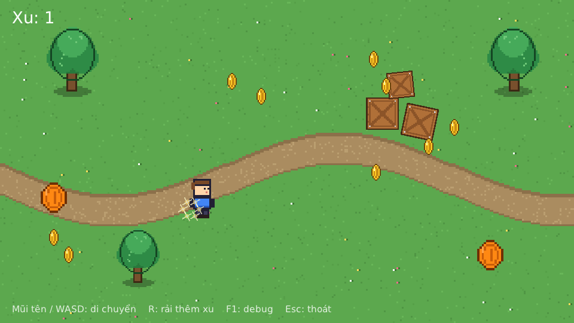

# Velo Engine

A 2D game engine written in [V](https://vlang.io), with a **Node + Component** architecture like Unity / Cocos Creator,
but with a simpler Scene/Prefab model and stricter asset management.



## Quick start

```bash
v run examples/demo          # coin collector demo: arrows/WASD, R scatters more coins, F1 debug, Esc quits
v run examples/demo --editor # scene/prefab editor (see the "Editor" section)
v run examples/kine2d        # skeletal animations exported from the Kine2D editor (see "Kine2D animation")
v test tests/                # unit tests for core, asset, serialize, scenedoc, physics (no GPU needed)
v run tools/assetdb.v examples/demo/assets list
```

### New project

Install the `velo` CLI once (any directory on your `PATH`), then use it from anywhere:

```bash
v -o ~/.local/bin/velo tools/velo
velo new mygame && cd mygame
velo editor        # or: velo run, velo build, velo assets list
velo run ios-sim   # or: velo run android — see "Android and iOS"
```

`velo` runs `v -path "@vlib|<parent of the repo>|@vmodules" ...`, so projects find `velo.*` without symlinks or copies
(the repo directory must therefore be named `velo`).
The engine location is baked in when `velo` is built; set `VELO_HOME` to override it.

Tested with V 0.5.2 (release and master). Graphics use V's built-in `gg` module
(on top of sokol: Metal on macOS, D3D11 on Windows, OpenGL on Linux), nothing else to install.
The optional `physics` module (used by the demo) needs [Box2D](https://box2d.org) v3.1+ as a system library:
`brew install box2d` on macOS, or build and install it from source elsewhere
(or build with `-d box2d_source` after `velo deps`, which compiles Box2D into the game — mobile builds always do this).

## Structure

```
velo/         repo root = the `velo` module (import velo.core, velo.app, ...)
  core/       Node, Component, Scene, Input, Vec2/Color/Affine2       (no graphics dependency)
  assets/     AssetDatabase: .meta, stable IDs, AssetRef[T], reference counting, dependency graph, hot reload
  serialize/  .scene format, parser, reflection, Registry, SceneLoader (prefab + override), writer
  render/     Renderer (gg), Sprite, SpriteAnimator, Label, UI components (Button, ScrollView, Widget, Layout, ...)
  physics/    Box2D v3 bindings: PhysicsWorld, RigidBody, Box/Circle/CapsuleCollider (optional, no GPU needed)
  kine2d/     plays Kine2D editor exports (.skel.json + .atlas.json + .png): the Kine2D component (optional)
  app/        game loop, input, hot reload
  scenedoc/   scene/prefab editing model: undo/redo, prefab rules, diff-style saving (no GPU needed)
  editor/     editor UI (gg): Hierarchy, Scene view, Inspector, Assets, Play
  examples/demo/  sample game + assets (sprites, prefabs, scenes)
  examples/kine2d/  Kine2D animation sample (three exported characters)
  tools/          velo CLI (velo/) and asset tool (assetdb.v)
  tests/          unit tests
```

Module dependency order (no cycles): `assets` ← `core` ← `serialize` ← `render` ← `app`,
and `serialize` ← `scenedoc` ← `editor` (the editor also uses `render`), and `serialize` ← `physics`, `render` ← `kine2d` (imported by the game only).
As a result `core`, `assets`, `serialize`, `scenedoc`, `physics` run without a GPU (tests, tools, servers).

## Writing a component

Embed `core.Component`, declare `pub mut` fields, and override the lifecycle methods you need:

```v
pub struct PlayerController {
	core.Component
pub mut:
	speed      f32       = 220                 // serialized automatically, can be set in .scene files
	bounds_max core.Vec2 = core.Vec2{936, 530}
	velocity   core.Vec2 @[hide]               // @[hide]: not serialized
}

pub fn (mut p PlayerController) update(dt f32) {
	dir := core.vec2(p.input().axis_x(), p.input().axis_y()).normalized()
	p.node.position = p.node.position + dir.mul(p.speed * dt)
	if mut sprite := p.node.get_component[render.Sprite]() {
		sprite.flip_x = dir.x < 0
	}
}
```

Then register it with one line: `game.register[PlayerController]()`.

| Lifecycle | When |
|---|---|
| `on_load()` | the component enters the scene (the node already has a parent, sibling components are present) |
| `start()` | once, right before the first `update` |
| `update(dt)` | every frame, while the node is active and the component is enabled |
| `on_destroy()` | the node is destroyed or the scene is unloaded |

Common APIs: `node.get_component[T]()`, `node.add_component(&T{...})`, `node.find('Weapon/Muzzle')`,
`scene.find('World/Player')`, `node.world_position()`, `node.destroy()` (safe to call during update),
`scene.instantiate('prefabs/coin.scene', mut parent)`.

V's reflection (`$for field in T.fields`) handles reading/writing fields, so **no serialization code is needed**.
Supported field types: `f32 f64 int bool string core.Vec2 core.Color assets.AssetRef[...]`.

## Scene = Prefab

There is only **one** file format. A scene is simply a prefab chosen as the root when running.

```
node Coin {
  Sprite { texture = @asset("c0149b7d")  size = [32, 32] }
  SpriteAnimator { fps = 10 }
  Pickup { radius = 30  value = 1 }
}
```

- `node Name { ... }` — a node; node properties: `position rotation scale active`
- `ComponentName { field = value }` — a component
- `node X from @asset("id") { ... }` — an instance of another prefab; the block inside is an **override**
- A prefab **variant** = a prefab whose root is `from` another prefab (see `prefabs/big_coin.scene`). No separate concept needed.

There is only one override rule: everything written in a `from` block is applied on top of a copy of the prefab.
Existing components → only the written fields are overwritten; new components → added; `node Child {}` matching an existing child's name → recursive override.
When saving (`loader.save_node`), instances **only write what differs from the source prefab**, so edits to a prefab propagate everywhere it is used.

Errors always include the file name and line number, e.g. `prefabs/coin.scene:5: Pickup has no serializable field "radis"`.
Circular prefab references are detected and reported.

Prefabs can also be built in code (type-checked by the compiler), handy for small effects:

```v
mut fx := core.Node.new('Sparkle')
	.with(&render.Sprite{ texture: tex, size: core.vec2(18, 18) })
	.with(&FadeAway{ duration: 0.5 })
```

## UI

UI nodes are ordinary nodes (world = screen, there is no camera). A `UITransform` gives a node its rectangle;
the other UI components draw it, react to the mouse inside it, or position nodes relative to it.

```
node MoreCoins {
  UITransform { size = [160, 40] }                                  # rectangle: size + anchor
  Widget { align_right = true  right = 16  align_top = true  top = 14 }
  Panel { color = [70, 130, 220, 255]  radius = 8  border_width = 1 }
  Button { }
  node Text { Label { text = "More coins"  align = "center"  valign = "middle" } }
}
```

| Component | What it does |
|---|---|
| `UITransform` | `size` + `anchor` of the node's rectangle (used by everything below, and for picking in the editor) |
| `Panel` | fills the rectangle: `color`, `radius` (rounded corners when not rotated), `border_color`, `border_width` |
| `Label` | text; `align` left/center/right, `valign` top/middle/bottom. With a UITransform it aligns inside the rectangle |
| `Button` | click (or tap, with any finger) on the rectangle (UITransform or Sprite). `btn.on_click(fn (mut b render.Button) {...})` or poll `btn.clicked` (true for one frame). Tints the Panel/Sprite of `target` by state (`normal/hover/pressed/disabled_color`, multiplied with its own color); `interactable = false` disables it |
| `Toggle` | with a Button on the same node: each click flips `is_on` and shows/hides the `checkmark` child (`changed` is true for that frame) |
| `ProgressBar` | draws `back_color` + a `fill_color` part for `progress` (0..1); `direction` horizontal/vertical, `reverse` |
| `ScrollView` | shows the `content` child through the rectangle: drag or mouse wheel, `inertia`, `elastic` edges, `clip`; `horizontal`/`vertical`; `scroll_to_top()`/`scroll_to_bottom()`. Buttons inside cancel their press once a drag starts, and are not clickable outside the viewport |
| `Widget` | aligns the node to the edges/center of the parent's rectangle (or the screen if the parent has none); left + right (or top + bottom) stretches the UITransform. Aligned to the screen it stays inside the phone's safe area (notch, rounded corners, system bars); `safe_area = false` reaches the real edges (full-bleed backgrounds) |
| `Joystick` | on-screen thumb stick: a finger (or the mouse) going down in the rectangle moves the `knob` child up to `radius` from the `base` child; read `value` (-1..1 per axis). `floating` moves the base under the thumb |
| `Layout` | arranges children in a `vertical`/`horizontal` list or a `grid` (`spacing`, `padding`, `child_align`, `columns`); `resize` grows the UITransform to fit, which is what a ScrollView content needs |

`Input` also has `mouse_pressed` / `mouse_released` (one frame) and `scroll` (wheel delta this frame).
Touch: `input.touches` lists every finger (`id`, `pos`, `start`, `phase` began/moved/stationary/ended/cancelled) and
the first finger also drives the mouse fields; `input.pointers()` is every finger plus the held mouse, for code that
should work the same with both. `scene.safe_insets` holds the safe area (world units); on desktop,
`VELO_SAFE_AREA="left,top,right,bottom"` fakes one to try a phone layout, and F1 outlines it.
The demo's HUD uses a Button (`SpawnButton`) and a ScrollView + Layout pickup log (`PickupLog`, see `examples/demo/hud.v`).

Limits: overlapping buttons all receive the click (no event blocking yet); Widget/Layout run in `update`, so the editor
shows them at their saved positions until you press Play; the anchor gizmo (Y) only edits Sprite anchors.

## Physics

2D physics with [Box2D](https://box2d.org) v3. It is opt-in: register the components with the game's own ones
(`physics.register_builtins(mut r)`, see `examples/demo/main.v`), and the engine does not link Box2D unless you do.

```
node Main {
  PhysicsWorld { gravity = [0, 980] }                 # on the root (or any ancestor of the bodies)
  node Ground {
    position = [480, 520]
    BoxCollider { size = [960, 40] }                  # collider without a RigidBody = static
  }
  node Ball {
    RigidBody { }                                     # dynamic by default
    CircleCollider { radius = 16  restitution = 0.5 }
  }
}
```

| Component | What it does |
|---|---|
| `PhysicsWorld` | one Box2D world: `gravity` (pixels/s², y down), `pixels_per_meter` (default 50), `fixed_step`, `sub_steps`, `max_steps`. Steps in its own `update`, before its children update. `world.raycast(from, to)` returns the closest hit |
| `RigidBody` | `body_type` dynamic/kinematic/static, `gravity_scale`, `linear_damping`, `angular_damping`, `fixed_rotation`, `bullet`. `velocity()`/`set_velocity`, `angular_velocity()`/`set_angular_velocity`, `apply_force`, `apply_impulse`, `apply_torque`, `mass()`, `set_body_type` |
| `BoxCollider` / `CircleCollider` / `CapsuleCollider` | a shape (`size` or `radius`, `offset`) with `density`, `friction`, `restitution`, `sensor`. Becomes a shape of the RigidBody on the same node; without one it gets its own static body that follows the node |

Everything is in world units (pixels) and degrees, like the rest of the engine; mass and density stay in Box2D units (kg, kg/m²).
The body follows the node in world space, so bodies can live under moved/rotated parents, and setting `node.position`
from code teleports the body. Collider shapes use the node's world scale when they load.

Contacts are polled like `Button.clicked`: every collider has `touching` (current), `began` and `ended` (this frame only),
each a `Contact` with the other `node`, a `normal` pointing toward it, a `point` and whether it was a `sensor` overlap.

```v
if col := p.node.get_component[physics.CircleCollider]() {
	for c in col.began {
		if c.node.name == 'Spikes' { p.node.destroy() }
	}
}
```

In debug mode (F1) and in the editor, colliders are outlined (green, sensors yellow): the renderer draws any component
with `debug_outline()`/`debug_color()` (`render.DebugShape`). In the demo the crates are pushable bodies, the trees
have static trunk colliders and the player moves with `set_velocity`.

Limits: no joints, polygon/chain shapes, collision filtering or interpolation yet; shapes are built once (edit a collider's
fields at runtime and they will not be rebuilt); colliders on child nodes do not join the parent's RigidBody.

## Kine2D animation

The optional `kine2d` module plays skeletal animations made in the Kine2D editor. Its **BUILD** button writes
`<name>.skel.json`, `<name>.atlas.json` and `<name>.png`: copy all three into the assets directory, register the
component (`kine2d.register_builtins(mut r)`, see `examples/kine2d/main.v`) and point a `Kine2D` at the two JSON files:

```
node Goblin {
  position = [790, 440]                       # where the editor's canvas center was
  scale = [-1.6, 1.6]                         # negative x = mirrored
  Kine2D { data = @asset("4b1e0c11")  atlas = @asset("4b1e0c12")  animation = "idle" }
}
```

| Field | What it does |
|---|---|
| `data` / `atlas` | the `.skel.json` and `.atlas.json` (text assets); the atlas image is found next to the atlas file |
| `animation` | clip to play (`''` = the first one); changing it restarts from frame 0 |
| `skin` | skin id or name (`''` = the skin active when exporting) |
| `speed`, `playing`, `looping`, `color` | playback rate (negative plays backwards), pause, loop or stop at the end, tint |
| `canvas_size` | the editor canvas size the rig was built on; `0` = the export's `canvasSize` (800x600 if it has none) |

From code: `k.play('attack', false)` then poll `k.finished` (true once a non-looping clip reached its end),
`k.animations()`, `k.skins()`, `k.current_animation()`, `k.duration()`, `k.time`. The sample's `PlayOnce`
(`examples/kine2d/controls.v`) plays a clip once and returns to the one it interrupted.

Supported: region and mesh attachments, weighted meshes (skinning), mesh deform keys, bezier/easing curves on
position and rotation keys, scale keys, skins, attachment switching (display index keys) and draw order keys.
Editing the exported files hot reloads them. It draws textured triangles through the renderer's `render.MeshDrawable`
hook, so any component with a `meshes() []render.TexturedMesh` method is drawn the same way.

Limits: IK, transform and physics constraints and event keys are not applied yet (bake them into keys before exporting);
the binary export (`.skel.bin`) is not read, only the JSON one; the editor cannot click-select a skeleton in the scene view
(select it in the Hierarchy); `velo assets unused` does not know that the atlas uses its image.

## Asset management

- **Stable IDs** in a `.meta` file next to each asset (created if missing). Scenes reference assets by ID,
  so renaming/moving a file (along with its `.meta`) breaks nothing. Commit `.meta` files to Git.
- **`.meta` uses `key: value`** lines, easy to read and diff; it holds the import settings:
  ```
  id: c0149b7d
  kind: texture
  version: 1
  filter: nearest        # pixel art
  frame_width: 16        # sprite sheet -> SpriteAnimator knows the frame count
  frame_height: 16
  ```
- **Typed `AssetRef[T]`**: assigning an `AssetRef[AudioClip]` to an `AssetRef[Texture]` field is a compile error;
  an ID pointing to a file of the wrong kind reports a clear error on load.
- **Reference counting**: `db.load[T]` / `db.release(id)`. `Sprite` loads automatically in `on_load` and releases in `on_destroy`;
  when nothing uses an asset anymore, it is freed and the renderer deletes the texture on the GPU.
- **Dependency graph**: knows which asset uses which → find unused assets, check before deleting,
  know exactly what to package for a scene.
- **Duplicate ID detection** (copying a file along with its `.meta`) with automatic reassignment of a new ID.
- **Hot reload**: edit an image → the new image is drawn immediately; edit a `.scene`/prefab → the scene reloads (on a syntax error the old scene is kept).

```
$ v run tools/assetdb.v examples/demo/assets unused scenes/main.scene
Assets not used by scenes/main.scene:
  9f00aa12  sprites/rock_unused.png

$ v run tools/assetdb.v examples/demo/assets users sprites/coin.png
sprites/coin.png used by:
  d2c8f1a9  prefabs/coin.scene
```

## Editor

```bash
v run examples/demo --editor
```

The editor is compiled **together with** the game's components (V does not load code at runtime), so the game just needs a flag:

```v
if '--editor' in os.args {
	mut ed := editor.new(assets_dir: assets_dir, scene: 'scenes/main.scene')!
	register_components(mut ed.registry)   // same registration function as the game
	ed.run()
	return
}
```

| Area | What it does |
|---|---|
| Hierarchy | select, add/duplicate/delete, reorder; drag and drop to reparent (dropping on the top/bottom edge of a row = insert before/after). Prefab instances are shown in blue |
| Scene view | click to select (Sprite or UITransform rectangle) (clicking a child of a prefab selects the instance root), drag the body to move freely, right/middle mouse or Alt+drag: pan, mouse wheel: zoom, F: frame all |
| Gizmos | **W** Move (drag an arrow to move along one axis, the square to move freely), **E** Rotate (drag the ring), **R** Scale (drag a box to scale one axis, the center box for uniform scale), **Y** Anchor (drag the pivot circle to move the Sprite's anchor, or click one of the 9 dots on its corners/edges/center; the sprite and children stay in place, only the pivot used by rotate/scale moves), **T** toggles local/global move axes. Shift snaps (10px / 15° / 0.1 / 0.1), Esc cancels the drag, each drag is one undo step. Also available as toolbar buttons |
| Inspector | generated from the `Registry` (no editor code needed per component). Fields overridden relative to the prefab are highlighted in yellow. Add/remove components, assign assets, "Create prefab from this node", "Unpack prefab", "Open prefab" |
| Assets | double-click a scene/prefab to open it; drag prefabs/images into the Scene view or Hierarchy to add them (image -> node with a `Sprite`) |
| Toolbar | New, Save (Ctrl/Cmd+S), Save as (Ctrl+Shift+S), Undo/Redo (Ctrl+Z / Ctrl+Y), Play/Stop (Ctrl+P) |

- **Input fields** use `.scene` syntax: numbers, `"strings"`, `[255, 200, 0, 255]`; asset fields accept a path or ID and check the asset kind.
- **Play** builds a separate scene (while playing, the mouse wheel over the scene view is also sent to the game) from the current editing state; all changes made while playing are discarded on stop.
- **Prefab rules** match the file format: parts owned by the source prefab can only have their values edited (no delete/rename/move,
  no removing components); adding nodes/components to an instance is allowed. Saving still only writes what differs from the prefab; opening a prefab variant
  and saving it keeps `from`.
- **Hot reload in the editor**: editing a prefab (in another editor or a text editor) updates every instance in the open scene,
  keeping unsaved overrides.
- All editing logic lives in `scenedoc.Document` (no graphics dependency) and is unit tested; `editor/` is just the UI.

## Android and iOS

`velo build <target>` packages the game, `velo run <target>` also installs and starts it (and shows its log):

```bash
velo doctor                              # which targets this machine can build, and what is missing
velo run ios-sim                         # iOS Simulator (macOS + Xcode)
velo run android                         # first connected device / running emulator
velo build ios --release                 # signed .app + .ipa for devices
velo build android --release --aab       # Android App Bundle for Google Play
```

Output goes to `build/<target>/` in the project. Games need no code changes: on a phone `app.new` ignores
`assets_dir` and uses the packaged assets, the first finger acts as the left mouse button (so UI buttons, scroll views
and `input.mouse` work), and hot reload is off. The window is the whole screen: `scene.view_size` is the screen size in
points, which is not the desktop window size, so anchor UI with `UITransform` rather than fixed positions.

- **Android** is built with [vab](https://github.com/vlang/vab) (`v install vab && v -prod ~/.vmodules/vab`),
  plus the Android SDK, NDK and a JDK. Android Studio installs all three; velo uses its bundled JDK when `JAVA_HOME` is unset.
  The APK contains `assets/` and a file list (`velo_assets.txt`); on first launch after an install they are copied
  to the app's internal storage, because the asset database works on real files.
  Debug builds are signed with a debug key; set `android.keystore` in `velo.toml` for release signing.
- **iOS** needs macOS with Xcode. velo compiles the C that V generates with the Xcode toolchain (V's own iOS
  step targets 32-bit ARM), bundles `<name>.app` with `assets/` inside, and signs it: ad hoc for the simulator; for devices
  with your "Apple Development" identity and a provisioning profile for `app.id` (Xcode creates both once you sign in
  with your Apple ID under Settings > Accounts; `ios.identity` / `ios.provisioning_profile` pick specific ones).
- **Physics**: phones have no system Box2D, so mobile builds compile it from source. The sources are cloned into
  `thirdparty/box2d` in the engine directory the first time a game that imports `velo.physics` is built (or by `velo deps`).
- Asset IDs must be stable, so the build first runs `velo assets check`, which also creates missing `.meta` files — commit them.

App settings live in `velo.toml` (created by `velo new`; every key is optional, defaults come from the directory name):

```toml
[app]
name = "My Game"            # name under the icon
id = "com.example.mygame"   # bundle / package ID
version = "1.0.0"
build = 1                   # increase for every store upload
orientation = "landscape"   # landscape | portrait | any (iOS only for now)
icon = "icon.png"           # square PNG, 1024x1024

[android]
keystore = "release.keystore"   # passwords: VAB_KS_PASS / VAB_KS_ALIAS_PASS environment variables
keystore_alias = "release"

[ios]
min_version = "14.0"
simulator = "iPhone 17"
```

## Web

```bash
velo build web                 # build/web/index.html + .js + .wasm + .data (upload the folder as is)
velo build web --release       # emcc -O3
velo run web                   # build, then serve on http://localhost:8080 and open the browser
```

Needs [Emscripten](https://emscripten.org) (`brew install emscripten`; `velo doctor` checks it). The project's
`assets/` are preloaded at `/assets`, where `app.new` looks for them in a browser; hot reload is off. Browsers have
no font files, so text uses the first `.ttf` in `assets/fonts/` — ship one that covers your language.

How it works around V 0.5.2 + Emscripten (see `tools/velo/web.v` and `tools/velo/web/emcc.sh`):
- V compiles through a small `emcc` wrapper that fixes the generated C's `stdin/stdout/stderr` declarations
  for musl, uses a copy of `sokol_app.h` with its broken JavaScript operators repaired (`) = >`, `!= =`, `== =`),
  and drops `gg`'s embedded example font when the V install does not ship it;
- `-sGLOBAL_BASE=65536`: V's `vmemcpy` skips copies from addresses below 64 KiB, where wasm keeps static data;
- Boehm GC from V's bundled sources, single-threaded, collecting only between frames from a JS timer
  (`app/web_gc.h`): wasm locals are invisible to a conservative GC, so collecting inside a frame frees live objects;
- no `-prod` (it crashes V maps on wasm) — `--release` only raises the emcc optimization level.

Limits: no `velo.physics` yet (Box2D is not built for Emscripten); avoid closures that capture variables
(`fn [x] () {}`) in code that runs every frame — V 0.5.2's closure runtime corrupts the wasm heap;
files written at runtime (settings, saves) live in memory and are lost on reload.

## Current limitations and next steps

- Scene hot reload **resets game state** (score, positions) because the whole tree is rebuilt.
- Not yet available: audio (the `AudioClip` asset kind exists), physics joints, camera, z-order sorting (currently drawn in tree order),
  removing prefab components via override, a `library/` directory caching import results.
- Mobile: Android ignores `app.orientation` (it follows the device), there is no screen-size scaling (the game sees the
  screen size in points), and the iOS build patches two V 0.5.2 issues in the generated C (see `tools/velo/ios.v`).
- Editor: no copy/paste between scenes, multi-selection,
  save prompt when closing the window, or per-field "Revert" to the prefab value.
- Small note about `gg` 0.5.x: creating an image mid-frame leaves the cached image not yet uploaded to the GPU;
  `render/renderer.v` handles this (see `image_for`).
